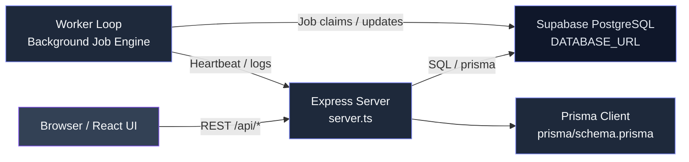
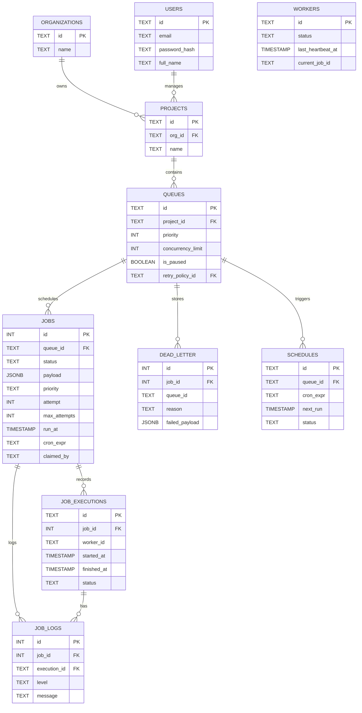
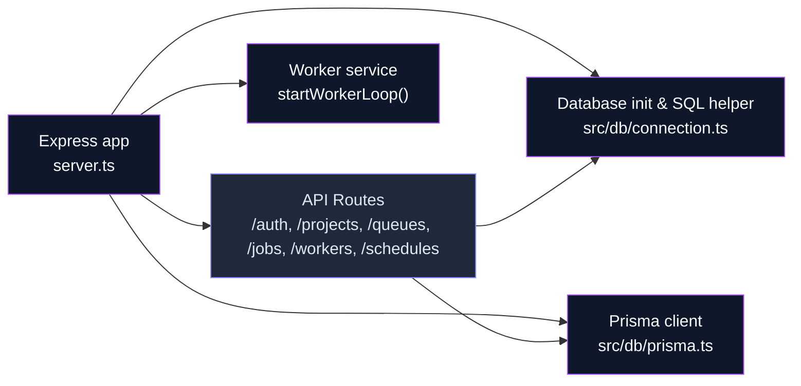
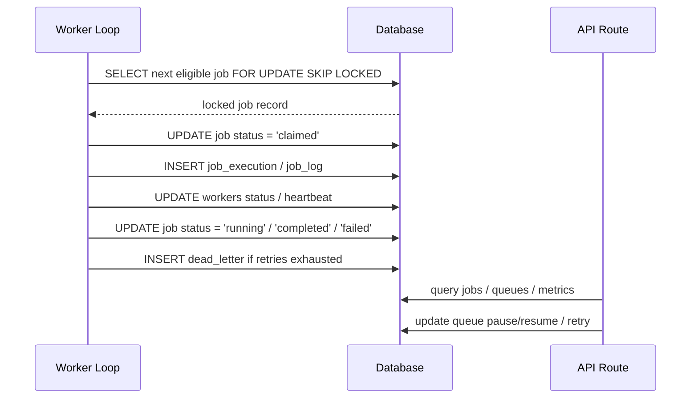
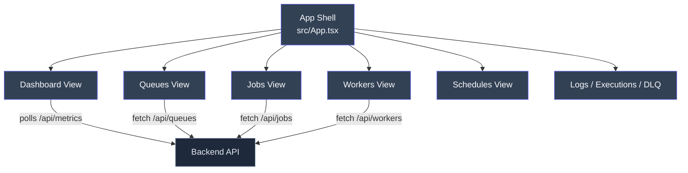
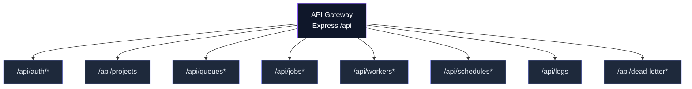
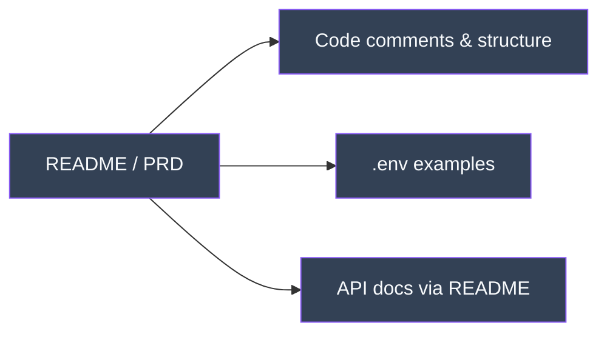
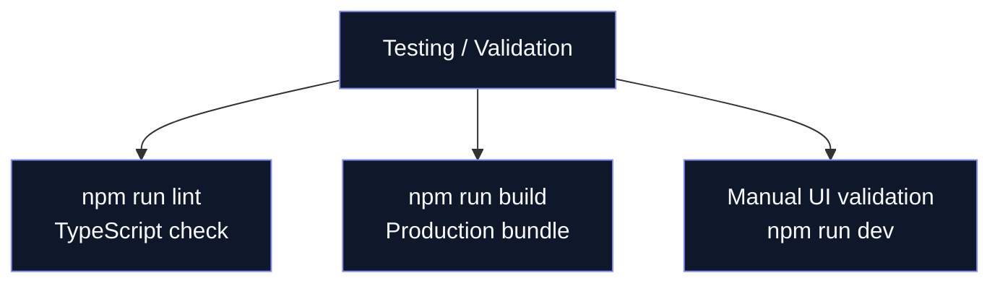

# Distributed Job Scheduler Dashboard

A full-stack dashboard demo for a Supabase PostgreSQL-backed job scheduler, with job queues, workers, executions, schedules, dead letter queue, and live metrics.

## Project overview

- Backend: Express server with PostgreSQL access
- Database: Supabase PostgreSQL using `DATABASE_URL` from `.env`
- ORM: Prisma client generated from `prisma/schema.prisma`
- Frontend: React + Vite single-page dashboard app
- Runtime: local development with `npm run dev`, production-ready build with `npm run build`

### System Architecture

- The app uses a single Express server (`server.ts`) to serve both API endpoints and the Vite-powered frontend in development.
- In production, the frontend is built by Vite and static assets are served from `dist/`.
- The backend uses a Supabase PostgreSQL database and the Prisma ORM for schema modeling.
- Frontend and backend communicate over REST endpoints under `/api/*`.

### Database Design

- The PostgreSQL schema is defined with tables for `users`, `organizations`, `projects`, `queues`, `jobs`, `job_executions`, `job_logs`, `workers`, `dead_letter`, and `schedules`.
- Relationships are enforced by foreign keys and cascade rules for cleanup.
- The database uses a trusted Supabase connection via `DATABASE_URL`.
- Prisma schema lives in `prisma/schema.prisma` and maps fields to the actual SQL column names.

### Backend Engineering

- Backend code is located in `server.ts` and `src/db/`.
- SQL connection helper is available in `src/db/connection.ts` and Prisma client initialization in `src/db/prisma.ts`.
- API routes provide authentication, user session, project and queue management, job lifecycle, schedules, and metrics.
- The backend includes database initialization and seeding logic for demo data.

### Reliability & Concurrency

- The app is designed for PostgreSQL transactional consistency.
- Background workers and schedule loops use transactions to update job state safely.
- The code-base is prepared for safely polling `jobs` and `schedules` with row-lock semantics.
- Production-ready deployment should use Supabase transaction pooler and proper `DATABASE_URL` settings.

### Frontend & UX

- The dashboard is built with React and provides views for jobs, queues, workers, schedules, dead letters, executions, and logs.
- Navigation is handled in `src/App.tsx` with a collapsible sidebar.
- The application gracefully falls back to login flows and session validation.
- The UI is optimized for a developer demo with clear metric panels and job management actions.

### API Design

- REST endpoints are available under `/api/`.
- Common endpoints include `/api/auth/*`, `/api/projects`, `/api/queues`, `/api/jobs`, `/api/executions`, `/api/logs`, `/api/workers`, `/api/schedules`.
- The backend uses JSON request/response bodies and standard HTTP status codes.
- Input validation is enforced using `zod` on key API routes.

### Documentation

- This README describes setup, architecture, and deployment steps.
- The codebase includes clear file structure and notes for the database and frontend.
- Environment variable requirements are documented in README and `.env` examples.

### Testing

- Basic validation is available through `npm run lint` (TypeScript compilation with `tsc --noEmit`).
- Build validation is available through `npm run build`.
- Manual runtime validation can be done by running `npm run dev` and exercising the UI.

## Architecture diagrams


### System Architecture



### Database Design



### Backend Engineering



### Reliability & Concurrency



### Frontend & UX



### API Design



### Documentation



### Testing


```

## Run locally

**Prerequisites:** Node.js 18+ and npm

1. Install dependencies:
   `npm install`
2. Create a `.env` file with your Supabase connection values, for example:
   ```
   DATABASE_URL="postgresql://<user>:<password>@<host>:6543/postgres?sslmode=require&pgbouncer=true"
   DIRECT_URL="postgresql://<user>:<password>@<host>:5432/postgres?sslmode=require"
   PORT=3000
   NODE_ENV="development"
   ```
3. Generate the Prisma client:
   `npm run prisma:generate`
4. Start the app in development:
   `npm run dev`

## Build and start

1. Create production build:
   `npm run build`
2. Start the production server:
   `npm start`

## Notes

- The server loads the database connection from `DATABASE_URL` in `.env`
- Prisma schema is defined in `prisma/schema.prisma`
- The app uses `src/db/prisma.ts` for Prisma client access
- If the backend still uses raw SQL helper code, the current project supports both Prisma and raw Postgres access

## Repository structure

- `server.ts` - Express backend and Vite middleware for development
- `src/` - React frontend source and database helpers
- `src/db/` - database connection and initialization logic
- `prisma/` - Prisma schema and generated client config

## Troubleshooting

- If `npm run dev` fails, verify your `.env` values and Supabase connection string
- Use `npm run lint` to validate TypeScript
- Use `npm run build` to verify production bundle generation
